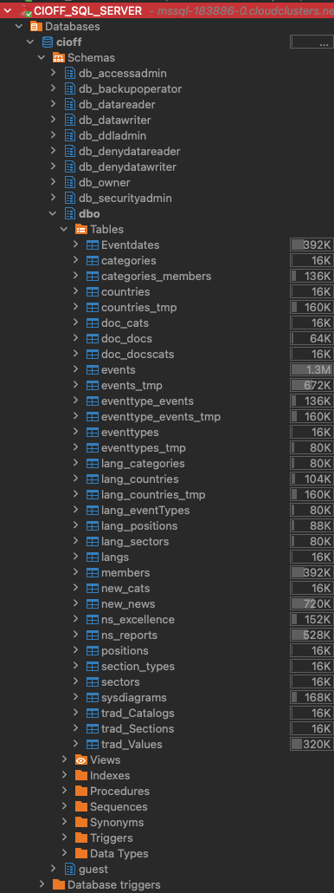

# Restore SQL Server DB

## Sign Up:

> File to restore: cioff_20240815_010004.bak

### Steps to Set Up a Free SQL Server Database on CloudClusters

1. Visit CloudClusters and create an account: https://clients.cloudclusters.io
2. Set Up a Free SQL Server Database:

- After logging in, navigate to the "Applications" section and choose "Create New Application".
- Select "SQL Server" as your application type.

3. Configure Your SQL Server Instance:

- Once your SQL Server application is created, go to `Applications > SQL Server-181635 > DB and User`

4. Create a Database

- In the "DB and User" section, create a new database. Name it `cioff`.

5. Create a User with Super Admin Privileges:

- After creating the database, create a new user. Name the user `root`, and assign super admin privileges.

## Send File to Restore through FTP

1. Go to `Applications > SQL Server-181635 > FTPS Server`.
2. Create an FTP connection and copy the credentials.
3. Open **Cyberduck** on macOS, or **FileZilla** on Windows.
4. Establish the FTP connection and transfer the file you want to restore.

## Restore Database

1. Go to `Applications > SQL Server-181635 > Overview`.
2. Copy the host, port, and user details.
3. Connect to your SQL Server using your preferred DB management tool (e.g., DBeaver).
4. Execute the following commands to restore the database:

```
  USE master; GO
```

```
  ALTER DATABASE cioff
  SET SINGLE_USER
  WITH ROLLBACK IMMEDIATE;
  GO
```

```
  RESTORE DATABASE cioff
  FROM DISK = '/cloudclusters/cioff_20240815_010004.bak'
  WITH REPLACE;
  GO
```

```
  ALTER DATABASE cioff
  SET MULTI_USER;
  GO
```

5. To check DB status works propertly

```
  SELECT name, state_desc FROM sys.databases WHERE name = 'cioff';
```

## Check tables



## Passwords

Cioff2024
$2a$10$xxIC6W.6CJpwKay4uh72XuQzRMt.kCjsri1uPOs26hiNOgsE5F8My

UltraDev2024
$2a$10$hlg9ywg6TKzvEVSdmEaWkePeIPIwDT58W3VX4QG1PDAay7CxZq41K
